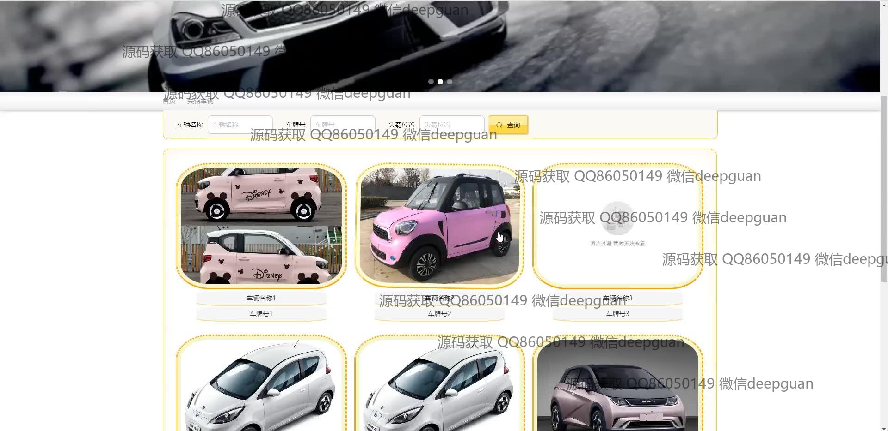
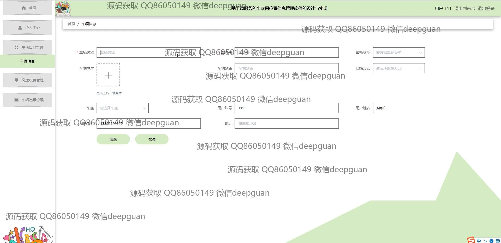

<h1 align="center">springcloud基于微服务的车联网位置信息管理软件的设计与实现</h1>

## 简介
基于Spring Boot和Spring Cloud的车联网位置信息管理软件：角色分为管理员、用户；功能包括车辆信息录入、位置监控、车辆状态管理、系统公告与留言管理。    --计算机毕业设计源码；毕设源码；java毕业设计源码

## 联系方式

<h3 align="center">获取完整代码与数据库文件 + 微信：deepguan QQ: 86050149 QQ群: 783742310</h3>

<h3 align="center">可帮忙远程部署 包运行成功！提供远程部署、修改代码、设计文档指导、代码讲解等服务！</h3>

## 功能介绍（完整见运行截图）
管理员： 管理员可以通过系统公告界面发布系统消息，并管理用户、车辆信息、失窃车辆、以及系统留言板的内容。管理员登录后可以查看和处理交通违章记录，车辆位置信息，审核和调整车辆相关数据，执行车辆偷窃信息发布，并维护用户登录和注册信息。同时，管理员还能够进行轮播图管理和审核用户提交的留言和审核车辆信息，提高系统管理效率。

用户： 用户可以在系统中进行注册和登录，进入个人中心查看和修改个人信息，包括用户名、密码、性别、年龄和联系方式等。在车辆信息模块中，用户可以输入和更新车辆详细信息，如车牌号、车型、颜色、换挡方式、罚款记录等，还可以上传车辆照片。用户也能参与系统留言，在留言板分享和互动。此外，用户可以通过主导航和其他管理模块浏览网站，进行个人用户相关的操作。

## 运行截图

本代码来源于网络,仅供学习参考使用!

